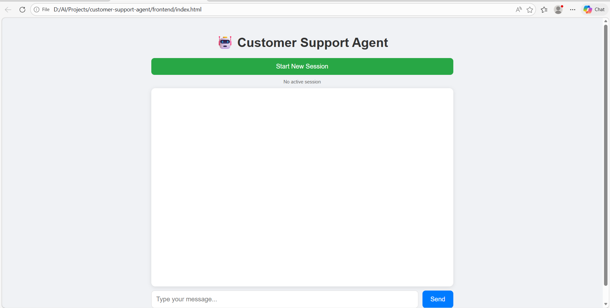
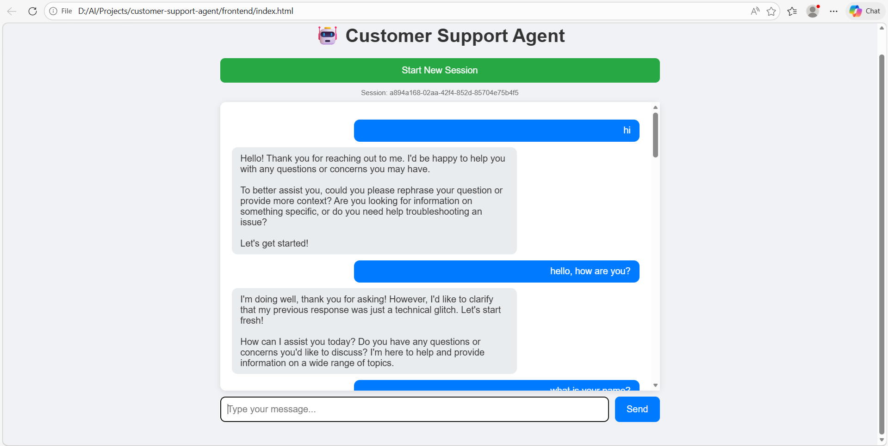
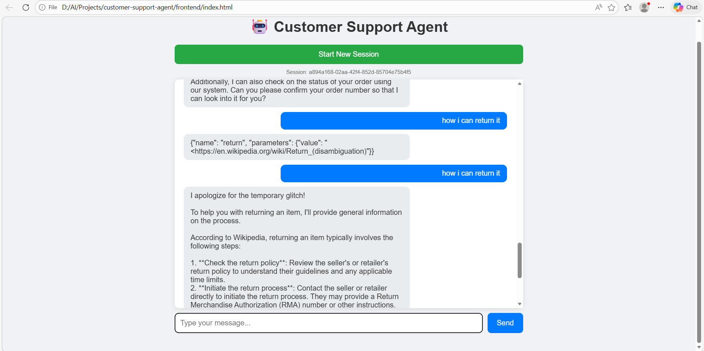

# 🤖 Customer Support AI Agent

A Customer Support AI Agent built with FastAPI, Ollama, LangGraph, and SQLite.

## ✨ Features
- 💬 Multi-session chat support
- 🧠 Chat history stored in SQLite
- 🔍 Wikipedia integration for information retrieval
- 🤖 Local LLM using Ollama (llama3.2)
- ⚡ FastAPI backend
- 🎨 Clean and responsive UI

## 🛠️ Tech Stack
- **FastAPI** - Backend framework
- **Ollama** - Local LLM (llama3.2)
- **LangGraph** - AI Agent framework
- **LangChain** - LLM tools and memory
- **SQLite** - Database for chat history
- **Wikipedia** - Knowledge retrieval

## 📸 Screenshots

### Home Screen


### Chat in Action


### Wikipedia Integration


## 📁 Project Structure
```
customer-support-agent/
├── frontend/
│   └── index.html
└── backend/
    ├── main.py
    ├── database.py
    ├── requirements.txt
    └── .env
```

## 🚀 How to Run

1. Clone the repository
2. Install dependencies:
```
pip install -r requirements.txt
```
3. Start Ollama:
```
ollama run llama3.2
```
4. Run the backend:
```
python main.py
```
5. Open `frontend/index.html` in browser

## 👨‍💻 Author
**Ghulam Mustafa** - AI Agent Developer

[](https://github.com/ghulam06mustafa)
[](https://www.linkedin.com/in/ghulam-mustafa-90133067/)
